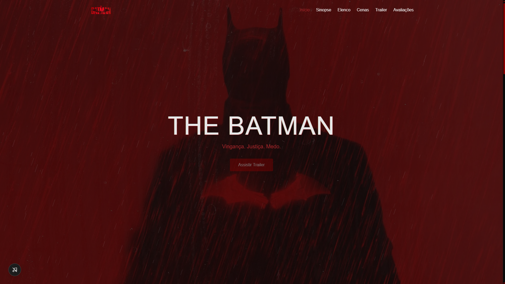

# The Batman — Landing Page

Landing page fan-made inspirada no filme **The Batman (2022)**, desenvolvida como projeto de portfólio front-end. O objetivo foi ir além de uma página estática simples, explorando animações, efeitos visuais temáticos e boas práticas de performance e acessibilidade.


---

## Live Demo

> [Acesse o site aqui](https://arthurguerraa.github.io/landing-page-the-batman/)

---

## 📸 Preview



---

## Stack utilizada

- **HTML5** — semântico, com atenção a acessibilidade (ARIA, `alt`, `aria-label`)
- **Tailwind CSS v4** — utilitário, com tema customizado via `@theme` (cores, fontes)
- **JavaScript (Vanilla)** — sem frameworks nem bibliotecas externas; todas as interações e animações foram implementadas com APIs nativas do navegador

---

## Funcionalidades

### Interface e navegação
- Header fixo, transparente no topo e sólido ao rolar
- Menu responsivo com animação suave de abertura/fechamento (mobile)
- Indicador de seção ativa no menu, sincronizado ao scroll (`IntersectionObserver`)
- Scroll suave nativo entre seções
- Botão "voltar ao topo" com aparição condicional

### Efeitos visuais
- **Preloader customizado** com barra de progresso baseada no carregamento real das imagens
- **Efeito parallax** na imagem de fundo do Hero
- **Chuva animada** em `<canvas>`, com ângulo e velocidade configuráveis
- **Efeito glitch** no título, disparado ao passar o mouse
- **Brilho neon com flicker** (CSS `@keyframes`) em títulos e botão de destaque
- **Efeito "lanterna"**: revela a imagem do elenco ao redor do cursor, com o restante escurecido
- **Cursor customizado** (ícone de expandir) sobre as imagens da galeria
- **Efeito de digitação estilo terminal** na sinopse, com cursor piscante

### Interatividade
- **Lightbox** para a galeria de cenas, com navegação por teclado (setas e Esc)
- **Carrossel automático** de avaliações, com loop infinito, pausa no hover e navegação por dots
- **Contagem numérica animada** nas notas de crítica
- **Player de áudio customizado** (Web Audio API) com loop sample-accurate, tocando um trecho da trilha sonora do filme
- **Trailer sob demanda**: o iframe do YouTube só é carregado após o clique do usuário (lazy load), com thumbnail e botão de play customizados

### Performance e acessibilidade
- Imagens em formato **WebP**, com `loading="lazy"` fora da primeira dobra
- Preloader ajustado para não bloquear em imagens lazy
- `aria-label`, `aria-expanded` e `role` em elementos interativos
- Contraste de cores revisado para atender WCAG AA
- Scrollbar customizada (Webkit e Firefox)

---


## Estrutura do projeto

```
the-batman-landing/
├── assets/
│   ├── audio/
│   ├── images/
│   └── output.css       (gerado pelo Tailwind)
├── src/
│   └── js/
│       └── main.js
├── index.html
└── README.md
```

---

## Rodando localmente

1. Clone o repositório
   ```bash
   git clone https://github.com/arthurguerraa/the-batman-landing.git
   ```
2. Instale as dependências (Tailwind CLI)
   ```bash
   npm install
   ```
3. Rode o build do Tailwind em modo watch
   ```bash
   npx @tailwindcss/cli -i ./src/input.css -o ./assets/output.css --watch
   ```
4. Abra o `index.html` com um servidor local (recomendado: extensão **Live Server** do VSCode)

---

## Aviso legal

Este é um projeto **fan-made**, sem fins lucrativos, desenvolvido exclusivamente para fins de estudo e portfólio. Todos os direitos sobre o filme *The Batman* (2022), suas imagens, personagens e trilha sonora pertencem à **Warner Bros.** Nenhuma violação de direitos autorais é pretendida.

---

## Autor

**Arthur Guerra**

- [GitHub](https://github.com/arthurguerraa)
- [LinkedIn](https://www.linkedin.com/in/arthurguerraa/)

---

<p align="center">Desenvolvido como projeto de portfólio — 2026</p>
